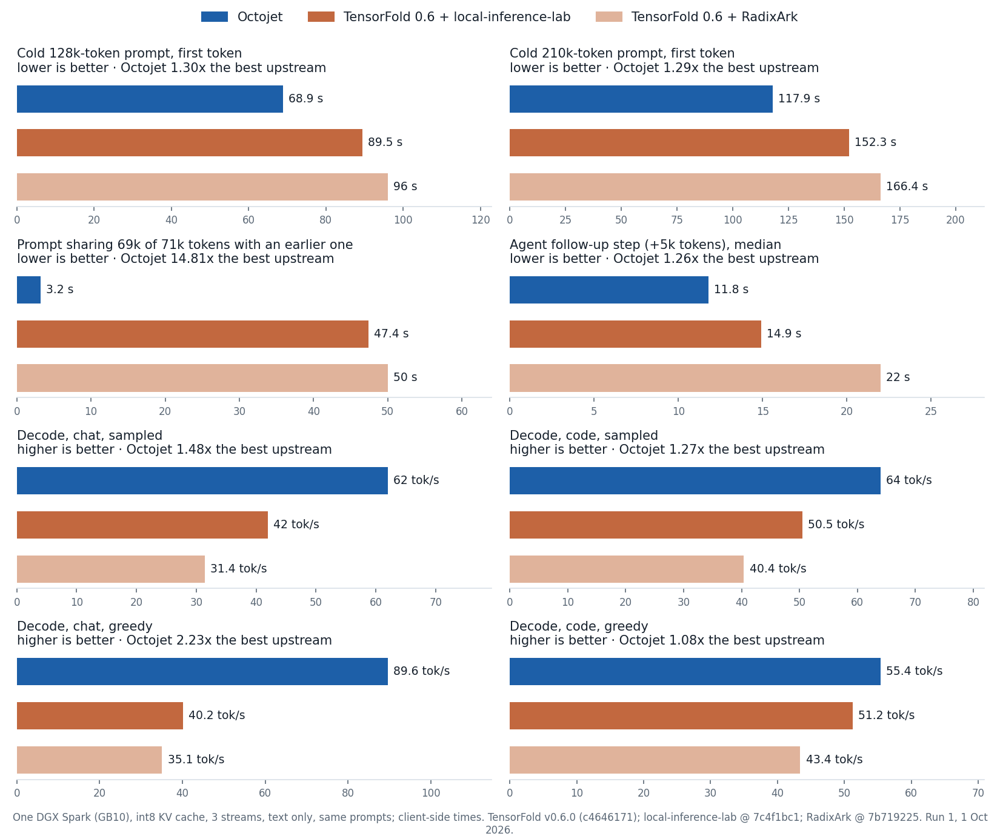
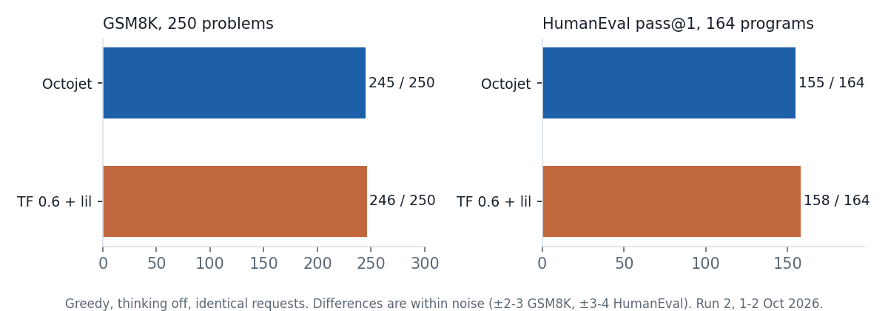
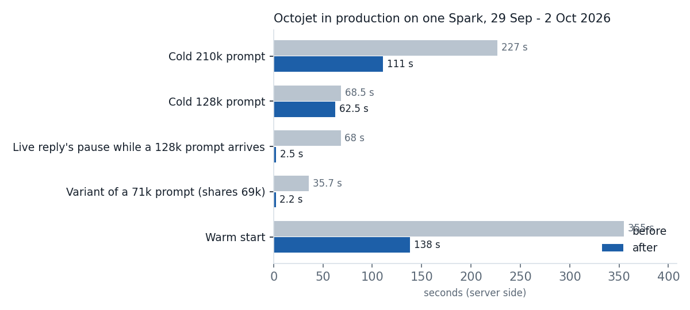

# Octojet

Octojet is an LLM inference engine for NVIDIA GB10 systems (DGX Spark), by Octolix. It is a fork of
[TensorFold](https://github.com/ashhart/TensorFold) 0.3.6.2 (commit 71377a5, MIT), tuned for one workload: Qwen3.8
Flash Next with native FP4 (NVFP4) routed experts, serving agent-style traffic (long prompts, follow-up turns, short
replies) on one GB10 box. Drafted decoding stays exact: every drafted reply equals what serial decoding produces with
the same settings.

What the fork adds to TensorFold 0.3.6.2: NVFP4 routed experts in TensorFold's grouped-expert kernels, a mixed
NVFP4 + MLX 4-bit checkpoint, an on-disk cache of packed expert tables, faster long prompts, prefix reuse (identical
prompts and shared prefixes), image and video input, prompts that prefill inside decode rounds, and tools that build
and check the published checkpoint. The full list is in [`engine/CHANGELOG.md`](engine/CHANGELOG.md).

**On one DGX Spark, against the fastest published setup (TensorFold v0.6.0 on the published NVFP4 checkpoints):**
about 1.3x faster on long prompts and agent steps, 1.1-2.2x faster decode, 9-15x faster on prompts that share a long
prefix with an earlier one, and the same accuracy. It is not lighter: it needs about 6 GiB more memory than the
smallest published checkpoint. Details, versions and methods: [`docs/benchmarks.md`](docs/benchmarks.md).



## Quick start

```bash
# NVIDIA's PyTorch container supplies CUDA, PyTorch and Triton
docker run -it --gpus all --ipc=host --network host nvcr.io/nvidia/pytorch:26.07-py3
python -m pip install "git+https://github.com/octolixai/octojet.git#subdirectory=engine"
octojet serve octolix/Qwen3.8-Flash-Next-Octojet-NVFP4 --kv-dtype int8 --parallel 3 --vision
```

The server speaks the OpenAI API at `http://127.0.0.1:8080/v1` (`--host 0.0.0.0` to listen on every interface). The
checkpoint is downloaded from Hugging Face on first use (`octojet pull <repo>` downloads without serving). Model card:
[octolix/Qwen3.8-Flash-Next-Octojet-NVFP4](https://huggingface.co/octolix/Qwen3.8-Flash-Next-Octojet-NVFP4).

### Packed-table cache

The first start packs the checkpoint's expert tables on the CPU (about ten minutes) and writes them to
`~/.cache/octojet/packed/<checkpoint key>/` (`$OCTOJET_CACHE_DIR` moves the root; `--packed-cache DIR` picks the
directory, `--packed-cache off` disables it, `--packed-cache verify` re-hashes the shards and every cached table).
Later starts read the tables back and take about 150 s. The cache takes about 64 GB on disk; the first start logs
its size. In a container, mount a volume and pass `--packed-cache DIR` on it, or the cache is rebuilt on every start.
A changed checkpoint rebuilds into a new directory beside the old one; old directories are never deleted, so remove
them yourself. Details: [`engine/docs/recipes/qwen3.8-flash-next.md`](engine/docs/recipes/qwen3.8-flash-next.md).

## Measured results

One DGX Spark (GB10, 128 GB), the same prompts and settings for every server: `--kv-dtype int8 --parallel 3`, text
only, drafting on (each engine's default), the GPU exclusive, page cache dropped before each start, times measured on
the client. Copied from [`docs/benchmarks.md`](docs/benchmarks.md), which has every table, the exact versions, the
settings and the scripts to reproduce them.

Versions compared:

| Name in tables | Engine | Checkpoint |
|---|---|---|
| Octojet | Octojet at e53e17d (run 1) and 78c1215 (run 2) | Octojet mixed NVFP4 as served in production (routed experts from `RadixArk/Qwen3.8-Flash-Next-NVFP4` @ 7b719225, everything else from `Vontra/Qwen3.8-Flash-Next-MLX-4bit-MTP` @ 2b170fa6) |
| TF 0.6 + lil | TensorFold v0.6.0 (c4646171), the latest release on 1 Oct 2026 | `local-inference-lab/Qwen3.8-Flash-Next-NVFP4` @ 7c4f1bc1 |
| TF 0.6 + RadixArk | TensorFold v0.6.0 (c4646171) | `RadixArk/Qwen3.8-Flash-Next-NVFP4` @ 7b719225, as published |

Run 1, 1 Oct 2026 (charted at the top of this page). Seconds unless stated; lower is better for times, higher for
decode.

| Measure | Octojet | TF 0.6 + lil | TF 0.6 + RadixArk |
|---|---:|---:|---:|
| Cold 128k-token prompt, first token | 68.9 | 89.5 | 96.0 |
| Cold 210k-token prompt, first token | 117.9 | 152.3 | 166.4 |
| Cold 71k-token prompt, first token | 32.4 | 46.1 | 52.6 |
| Variant sharing 69k of those 71k tokens | 3.2 | 47.4 | 50.0 |
| Decode, code prompt, temperature 1 (tok/s) | 64.0 | 50.5 | 40.4 |
| Decode, chat prompt, temperature 1 (tok/s) | 62.0 | 42.0 | 31.4 |
| Decode, code prompt, greedy (tok/s) | 55.4 | 51.2 | 43.4 |
| Decode, chat prompt, greedy (tok/s) | 89.6 | 40.2 | 35.1 |
| Agent: 80k-token first turn, first token | 53.5 | 68.3 | 77.0 |
| Agent: +5k-token follow-up, first token (median of 3) | 4.29 | 5.40 | 6.29 |
| Agent: +5k-token follow-up, whole step (median of 3) | 11.8 | 14.9 | 22.0 |
| Longest pause of a live reply while a 128k prompt arrives | 2.34 | 1.64 | 2.26 |
| Startup memory estimate | 87.2 GiB | 81.1 GiB | 97.4 GiB |
| Context windows | 3 × 262,144 reserved | up to 3 × 262,144 | up to 3 × 262,144 |
| Load time | 150 s | 205 s | 87 s |

Run 2, 1-2 Oct 2026: Octojet 78c1215 against TF 0.6 + lil; greedy, thinking off, the same requests for both.

| Measure | Octojet | TF 0.6 + lil |
|---|---:|---:|
| Cold 32k-token prompt, first token | 18.2 s | 19.8 s |
| A second, different cold 32k prompt | 16.9 s | 19.8 s |
| Cold 71k prompt / variant sharing 69k / identical resend | 37.8 / 4.9 / 0.12 s | 45.6 / 45.6 / 0.18 s |
| GSM8K, first 250 test problems | 0.980 (245) | 0.984 (246) |
| HumanEval pass@1, 164 programs | 0.945 (155) | 0.963 (158) |



Where Octojet does not lead: TF 0.6 + lil needs about 6 GiB less memory, scores 3 more HumanEval programs, and pauses
a live reply less while a long prompt arrives. Notes on superseded rows, the comparison with the MLX 4-bit checkpoint,
the earlier vLLM and EXL3 baseline and Octojet's production history are in [`docs/benchmarks.md`](docs/benchmarks.md).

### Octojet in production

Octojet has served production traffic on one Spark since 29 September 2026. Each change below shipped after tests on
the Spark; times are server-side.



| Change | Before | After |
|---|---|---|
| Warm start (packed-table cache) | ~355 s | 138 s |
| Cold 32k / 128k / 210k prompt | 15.2 / 68.5 / 227 s | 13.8 / 62.5 / 111 s |
| Identical prompt resent | 36.7 s | ~5 ms |
| Live reply's pause while a 128k prompt arrives | ~68 s | ~2.5 s |
| Variant of a 71k prompt (shares 69k) | 35.7 s | 2.2 s |

## Support scope

Supported and measured: NVIDIA GB10 with Qwen3.8 Flash Next NVFP4
([octolix/Qwen3.8-Flash-Next-Octojet-NVFP4](https://huggingface.co/octolix/Qwen3.8-Flash-Next-Octojet-NVFP4)), one
GPU, in NVIDIA's PyTorch container. Everything else in the tree (the Apple Silicon/MLX engines, the other model
families, two-machine tensor parallelism, EXL3 packs, other GPUs) is inherited from TensorFold and untested here.

Names kept from TensorFold: the Python package is `tensorfold` (`python -m tensorfold.cli` works like `octojet`), and
environment variables keep their `TENSORFOLD_*` names. Server logs use the `[octojet]` prefix and the per-reply stats
block is `"octojet"` (`"tensorfold"` before 0.1.0). The self-updater is disabled; update by reinstalling from this
repository.

## Repository layout

- `engine/`: the engine (the `octojet` Python package; source under `engine/src/tensorfold/`), its tests and tools.
- `bench/`: benchmark and accuracy harness (`acc_eval.py`, `agent_bench.py`, `cmp_probe.py`, the Spark scripts in
  `bench/spark/`).
- `docs/`: [`benchmarks.md`](docs/benchmarks.md), the [model card](docs/model-card.md) and the design
  ([`design.md`](docs/design.md)).
- `results/`: the reports and raw files of every measurement run.
- `lab/`: early experiments.

## Licenses

- The engine (`engine/`) is MIT: TensorFold's copyright and Octolix's, in [`engine/LICENSE`](engine/LICENSE). Code
  it adapts from other projects is listed in [`engine/THIRD_PARTY_NOTICES.md`](engine/THIRD_PARTY_NOTICES.md), with
  license texts in `engine/LICENSES/`. Octojet forks TensorFold 0.3.6.2 and ports a few later upstream commits, all
  from before upstream moved to Apache-2.0 at v0.6.0.
- The rest of this repository (`bench/`, `lab/`, `docs/`, `results/`) is MIT, Octolix: [`LICENSE`](LICENSE).
- The model weights are not in this repository. Qwen3.8 Flash Next and the published checkpoint are under the Qwen
  Community License 1.0; read its clause 2 before offering the model as a service.

Octojet is not affiliated with NVIDIA, Qwen or TensorFold.

## References

Everything Octojet is built on, compared against or measured with (the same list as in
[`docs/benchmarks.md`](docs/benchmarks.md)).

**Model**
- Qwen3.8 Flash Next: https://huggingface.co/Qwen/Qwen3.8-Flash-Next (Qwen Community License 1.0)

**Checkpoints Octojet's checkpoint is built from**
- RadixArk NVFP4 export (NVIDIA Model Optimizer): https://huggingface.co/RadixArk/Qwen3.8-Flash-Next-NVFP4 @ 7b719225242aacd3dbd3f9407468c2ee9a9d2594
- Vontra MLX 4-bit with MTP: https://huggingface.co/Vontra/Qwen3.8-Flash-Next-MLX-4bit-MTP @ 2b170fa6 (config-matched)

**Checkpoints compared against**
- local-inference-lab NVFP4: https://huggingface.co/local-inference-lab/Qwen3.8-Flash-Next-NVFP4 @ 7c4f1bc1a2d6847e0cbc01ac6b823f00251de8dd
- RadixArk NVFP4, as published (above)
- turboderp EXL3: https://huggingface.co/turboderp/Qwen3.8-Flash-Next-exl3, branch 3.05bpw_h5_ng5 @ 69e33439 (config-matched)
- NVIDIA NVFP4 (cited for context, not benchmarked): https://huggingface.co/nvidia/Qwen3.8-Flash-Next-NVFP4

**Engines**
- TensorFold, which Octojet forks (v0.3.6.2, commit 71377a5; MIT up to v0.5, Apache-2.0 from v0.6.0): https://github.com/ashhart/TensorFold. Compared against at v0.6.0 (c4646171). Ported from upstream: vision (v0.3.6.3), tiled sparse-attention block selection above 131,072 keys (a2dba9c), prompts inside decode rounds (d23087c, 68c6e35).
- vLLM: https://github.com/vllm-project/vllm, as built by https://github.com/blazux/qwen3.8-Flash-DGX @ bd60fcb1b492ca920f74df7462f05da7b6d98f73
- ExLlamaV3 (EXL3 format; int8/int4 KV cache scheme): https://github.com/turboderp-org/exllamav3

**Patches and code Octojet uses**
- MiaAI-Lab's TensorFold patches for Flash Next vision on one Spark (patches 0008, 0009 @ a3aa898): https://github.com/MiaAI-Lab/Qwen3.8-Flash-Next-Single-DGX-Spark-TensorFold
- Hugging Face Transformers (Qwen3-VL image and video preprocessing, Apache-2.0): https://github.com/huggingface/transformers
- PyTorch and Triton, from NVIDIA's container: https://github.com/pytorch/pytorch, https://github.com/triton-lang/triton
- Inherited from TensorFold (see `engine/THIRD_PARTY_NOTICES.md`): MLX and mlx-lm, mlx-vlm, oMLX, z-lab/dflash

**Benchmarks**
- GSM8K: https://github.com/openai/grade-school-math (first 250 test problems)
- HumanEval: https://github.com/openai/human-eval (all 164 programs, run in a container with no network)
